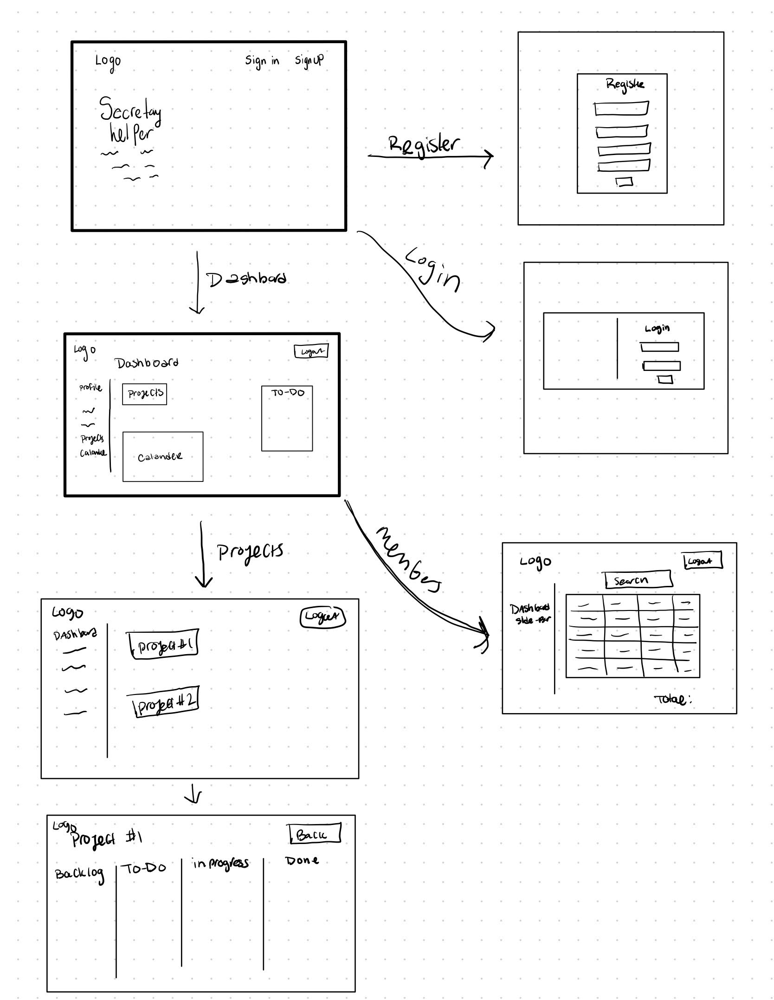

# Secretary-Helper

# Description

A full stack web application using the MERN stack technologies that allows samll churches and organizations to organize their tasks and members. 

## Link to website
https://secretary-helper.netlify.app

# Wireframe

# Dependencies
Server Side :
   * bcryptjs
   * body-parser
   * colors
   * concurrently
   * connect-ensure-login
   * cors
   * dotenv
   * express
   * express-async-handler
   * express-session
   * is-empty
   * jsonwebtoken
   * mongoose
   * morgan
   * nodemon
   * passport
   * passport-jwt

Client Side:

   * axios
   * cors
   * dotenv
   * jwt-decode
   * Create-create-app

# Challanges
One of the biggest challanges of this project was creating authentication, espceially protecting the routes. I got this to funciotn on the backend, but still have to work on the FrontEnd. 

# MVP 
* Create a user dasboard so that users add and delete items from a to-do list 
* Let users manage their maembers list 

# Post MVP
* Finish implementing user authenitcation
* Add Kanban board to projects 
